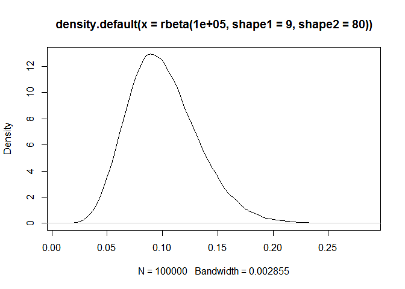
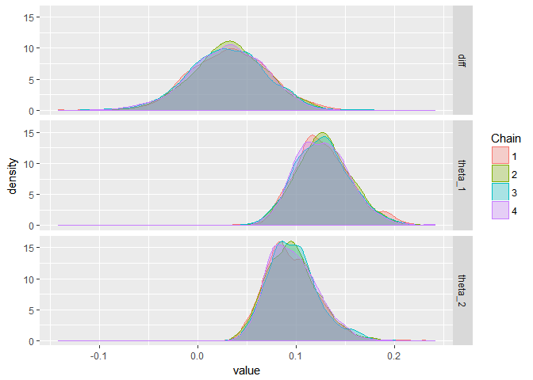
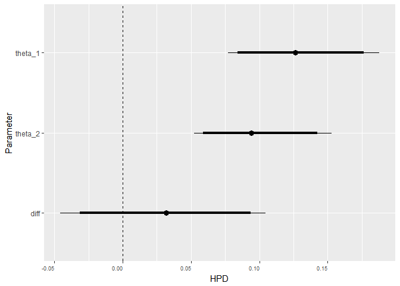

"Bayesian" Fisher Exact Test in Stan
================
TJ Mahr
May 14, 2017

This repository is an example I'm borrowing from [this talk by Bob Carpenter](https://www.youtube.com/watch?v=qQFF4tPgeWI).

Problem
-------

We observed the following data.

``` r
library(tibble)
library(dplyr, warn.conflicts = FALSE)

df <- tribble(
  ~ Sex, ~ Handedness, ~ n,
  "male", "left",  9,
  "male", "right", 43,
  "female", "left", 4,
  "female", "right", 44
)

knitr::kable(df)
```

| Sex    | Handedness |    n|
|:-------|:-----------|----:|
| male   | left       |    9|
| male   | right      |   43|
| female | left       |    4|
| female | right      |   44|

Is the rate of left-handedness different between men and women?

I'm not sure what this test is doing, but it's what one would do in classical statistics.

``` r
# Create a matrix for the test
m <- tidyr::spread(df, Handedness, n) %>% 
  as.data.frame()
rownames(m) <- m$Sex
m$Sex <- NULL
m
#>        left right
#> female    4    44
#> male      9    43

fisher.test(m)
#> 
#>  Fisher's Exact Test for Count Data
#> 
#> data:  m
#> p-value = 0.2392
#> alternative hypothesis: true odds ratio is not equal to 1
#> 95 percent confidence interval:
#>  0.09150811 1.71527769
#> sample estimates:
#> odds ratio 
#>  0.4378606
fisher.test(m, alternative = "less")
#> 
#>  Fisher's Exact Test for Count Data
#> 
#> data:  m
#> p-value = 0.1502
#> alternative hypothesis: true odds ratio is less than 1
#> 95 percent confidence interval:
#>  0.000000 1.427233
#> sample estimates:
#> odds ratio 
#>  0.4378606
```

Fit the model in Stan
---------------------

But I know Stan so I can compute a posterior probability of the difference between men and women.

I think that 10% of people are left handed. I don't know where I heard this number first, but it'll serve as my prior information. I messed around with `a` and `b` until I got the follow prior, which is peaked around .1-ish and keeps .5 and .15 as still plausible values.

``` r
plot(density(rbeta(100000, 9, 80)))
```



I write out a really simple model in Stan.

``` stan
# This knitr block also creates a `stanmodel()` object in R called `stan_model`
data {
  int<lower=0> n_total_1;
  int<lower=0> n_total_2;
  int<lower=0> n_hits_1;
  int<lower=0> n_hits_2;
}
parameters { 
  real<lower=0, upper=1> theta_1;
  real<lower=0, upper=1> theta_2;
}
model {
  theta_1 ~ beta(9, 80);
  theta_2 ~ beta(9, 80);
  n_hits_1 ~ binomial(n_total_1, theta_1);
  n_hits_2 ~ binomial(n_total_2, theta_2);
}
generated quantities {
  real diff;
  diff = theta_1 - theta_2;
}
```

And fit it.

``` r
stan_data <- list(
  n_total_1 = 9 + 43,
  n_total_2 = 3 + 44,
  n_hits_1 = 9,
  n_hits_2 = 4
)

library(rstan)
#> Loading required package: ggplot2
#> Loading required package: StanHeaders
#> rstan (Version 2.15.1, packaged: 2017-04-19 05:03:57 UTC, GitRev: 2e1f913d3ca3)
#> For execution on a local, multicore CPU with excess RAM we recommend calling
#> rstan_options(auto_write = TRUE)
#> options(mc.cores = parallel::detectCores())
model <- sampling(stan_model, data = stan_data)
#> 
#> SAMPLING FOR MODEL '619f27b660c2dcfc69a24b87feefd7c0' NOW (CHAIN 1).
#> 
#> Gradient evaluation took 0 seconds
#> 1000 transitions using 10 leapfrog steps per transition would take 0 seconds.
#> Adjust your expectations accordingly!
#> 
#> 
#> Iteration:    1 / 2000 [  0%]  (Warmup)
#> Iteration:  200 / 2000 [ 10%]  (Warmup)
#> Iteration:  400 / 2000 [ 20%]  (Warmup)
#> Iteration:  600 / 2000 [ 30%]  (Warmup)
#> Iteration:  800 / 2000 [ 40%]  (Warmup)
#> Iteration: 1000 / 2000 [ 50%]  (Warmup)
#> Iteration: 1001 / 2000 [ 50%]  (Sampling)
#> Iteration: 1200 / 2000 [ 60%]  (Sampling)
#> Iteration: 1400 / 2000 [ 70%]  (Sampling)
#> Iteration: 1600 / 2000 [ 80%]  (Sampling)
#> Iteration: 1800 / 2000 [ 90%]  (Sampling)
#> Iteration: 2000 / 2000 [100%]  (Sampling)
#> 
#>  Elapsed Time: 0.02 seconds (Warm-up)
#>                0.053 seconds (Sampling)
#>                0.073 seconds (Total)
#> 
#> 
#> SAMPLING FOR MODEL '619f27b660c2dcfc69a24b87feefd7c0' NOW (CHAIN 2).
#> 
#> Gradient evaluation took 0 seconds
#> 1000 transitions using 10 leapfrog steps per transition would take 0 seconds.
#> Adjust your expectations accordingly!
#> 
#> 
#> Iteration:    1 / 2000 [  0%]  (Warmup)
#> Iteration:  200 / 2000 [ 10%]  (Warmup)
#> Iteration:  400 / 2000 [ 20%]  (Warmup)
#> Iteration:  600 / 2000 [ 30%]  (Warmup)
#> Iteration:  800 / 2000 [ 40%]  (Warmup)
#> Iteration: 1000 / 2000 [ 50%]  (Warmup)
#> Iteration: 1001 / 2000 [ 50%]  (Sampling)
#> Iteration: 1200 / 2000 [ 60%]  (Sampling)
#> Iteration: 1400 / 2000 [ 70%]  (Sampling)
#> Iteration: 1600 / 2000 [ 80%]  (Sampling)
#> Iteration: 1800 / 2000 [ 90%]  (Sampling)
#> Iteration: 2000 / 2000 [100%]  (Sampling)
#> 
#>  Elapsed Time: 0.037 seconds (Warm-up)
#>                0.035 seconds (Sampling)
#>                0.072 seconds (Total)
#> 
#> 
#> SAMPLING FOR MODEL '619f27b660c2dcfc69a24b87feefd7c0' NOW (CHAIN 3).
#> 
#> Gradient evaluation took 0 seconds
#> 1000 transitions using 10 leapfrog steps per transition would take 0 seconds.
#> Adjust your expectations accordingly!
#> 
#> 
#> Iteration:    1 / 2000 [  0%]  (Warmup)
#> Iteration:  200 / 2000 [ 10%]  (Warmup)
#> Iteration:  400 / 2000 [ 20%]  (Warmup)
#> Iteration:  600 / 2000 [ 30%]  (Warmup)
#> Iteration:  800 / 2000 [ 40%]  (Warmup)
#> Iteration: 1000 / 2000 [ 50%]  (Warmup)
#> Iteration: 1001 / 2000 [ 50%]  (Sampling)
#> Iteration: 1200 / 2000 [ 60%]  (Sampling)
#> Iteration: 1400 / 2000 [ 70%]  (Sampling)
#> Iteration: 1600 / 2000 [ 80%]  (Sampling)
#> Iteration: 1800 / 2000 [ 90%]  (Sampling)
#> Iteration: 2000 / 2000 [100%]  (Sampling)
#> 
#>  Elapsed Time: 0.037 seconds (Warm-up)
#>                0.042 seconds (Sampling)
#>                0.079 seconds (Total)
#> 
#> 
#> SAMPLING FOR MODEL '619f27b660c2dcfc69a24b87feefd7c0' NOW (CHAIN 4).
#> 
#> Gradient evaluation took 0 seconds
#> 1000 transitions using 10 leapfrog steps per transition would take 0 seconds.
#> Adjust your expectations accordingly!
#> 
#> 
#> Iteration:    1 / 2000 [  0%]  (Warmup)
#> Iteration:  200 / 2000 [ 10%]  (Warmup)
#> Iteration:  400 / 2000 [ 20%]  (Warmup)
#> Iteration:  600 / 2000 [ 30%]  (Warmup)
#> Iteration:  800 / 2000 [ 40%]  (Warmup)
#> Iteration: 1000 / 2000 [ 50%]  (Warmup)
#> Iteration: 1001 / 2000 [ 50%]  (Sampling)
#> Iteration: 1200 / 2000 [ 60%]  (Sampling)
#> Iteration: 1400 / 2000 [ 70%]  (Sampling)
#> Iteration: 1600 / 2000 [ 80%]  (Sampling)
#> Iteration: 1800 / 2000 [ 90%]  (Sampling)
#> Iteration: 2000 / 2000 [100%]  (Sampling)
#> 
#>  Elapsed Time: 0.039 seconds (Warm-up)
#>                0.037 seconds (Sampling)
#>                0.076 seconds (Total)
model
#> Inference for Stan model: 619f27b660c2dcfc69a24b87feefd7c0.
#> 4 chains, each with iter=2000; warmup=1000; thin=1; 
#> post-warmup draws per chain=1000, total post-warmup draws=4000.
#> 
#>           mean se_mean   sd    2.5%    25%    50%    75%  97.5% n_eff Rhat
#> theta_1   0.13    0.00 0.03    0.08   0.11   0.13   0.15   0.19  3429    1
#> theta_2   0.10    0.00 0.03    0.05   0.08   0.09   0.11   0.15  3318    1
#> diff      0.03    0.00 0.04   -0.05   0.01   0.03   0.06   0.10  3367    1
#> lp__    -97.76    0.03 1.07 -100.60 -98.13 -97.43 -97.04 -96.76  1595    1
#> 
#> Samples were drawn using NUTS(diag_e) at Sun May 14 12:29:55 2017.
#> For each parameter, n_eff is a crude measure of effective sample size,
#> and Rhat is the potential scale reduction factor on split chains (at 
#> convergence, Rhat=1).
```

To get the Bayesian p-value (to compare the two procedures).

``` r
draws <- rstan::extract(model)

# p(men are more left handed than women)
mean(draws$diff > 0)
#> [1] 0.79275

# p("null" hypthosis)
mean(draws$diff <= 0)
#> [1] 0.20725
```

Use ggmcmc is to visualize the effects.

``` r
library(ggmcmc)
#> Loading required package: tidyr
#> 
#> Attaching package: 'tidyr'
#> The following object is masked from 'package:rstan':
#> 
#>     extract

# Get ggmcmc's tidy data of the model
ggs <- ggs(model)

ci(ggs, thick_ci = c(0.05, 0.95), thin_ci = c(0.025, 0.975)) %>% 
  knitr::kable(digits = 2)
```

| Parameter |    low|    Low|  median|  High|  high|
|:----------|------:|------:|-------:|-----:|-----:|
| diff      |  -0.05|  -0.03|    0.03|  0.09|  0.10|
| theta\_1  |   0.08|   0.08|    0.13|  0.18|  0.19|
| theta\_2  |   0.05|   0.06|    0.09|  0.14|  0.15|

``` r

ggs_density(ggs) + facet_grid(Parameter ~ .)
```



``` r

ggs_caterpillar(ggs, line = 0)
```


